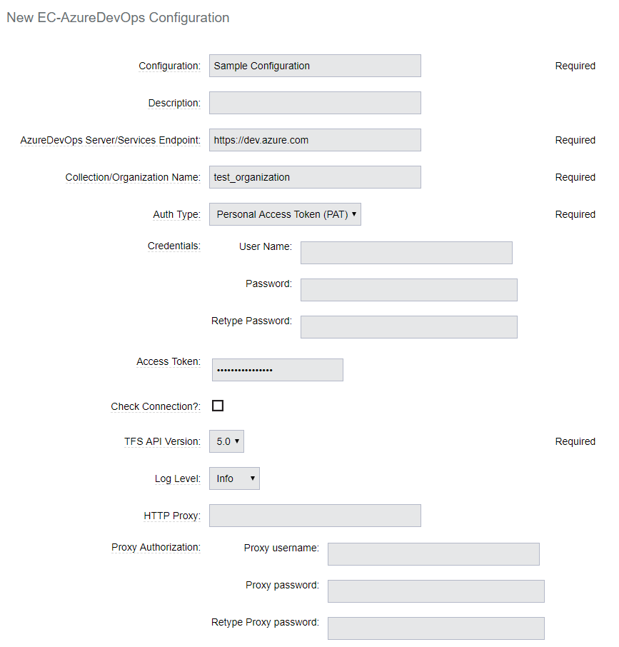
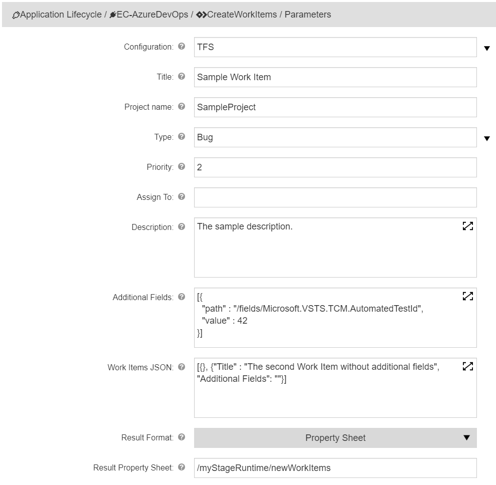
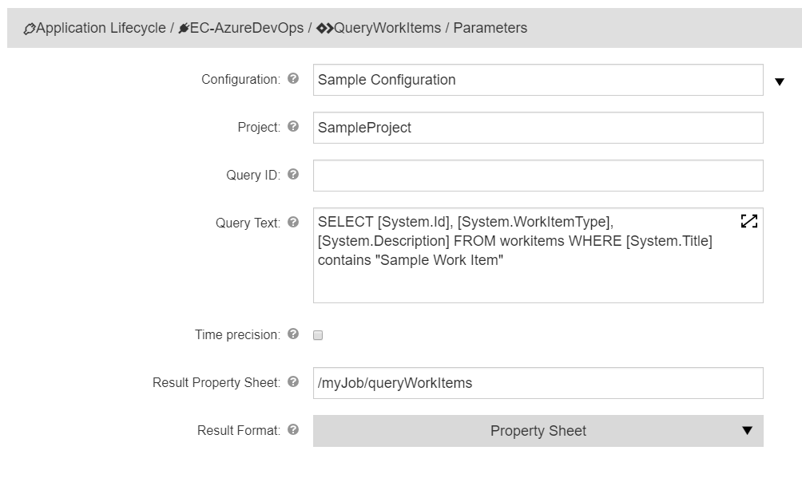
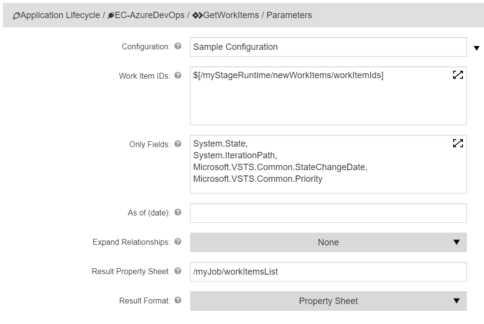
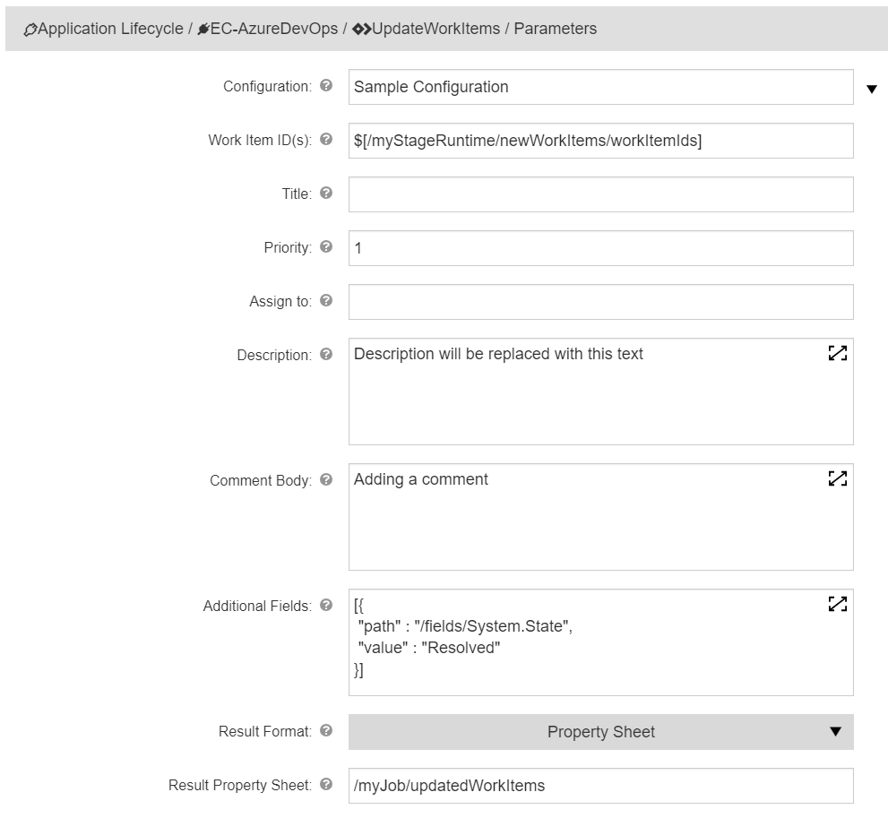
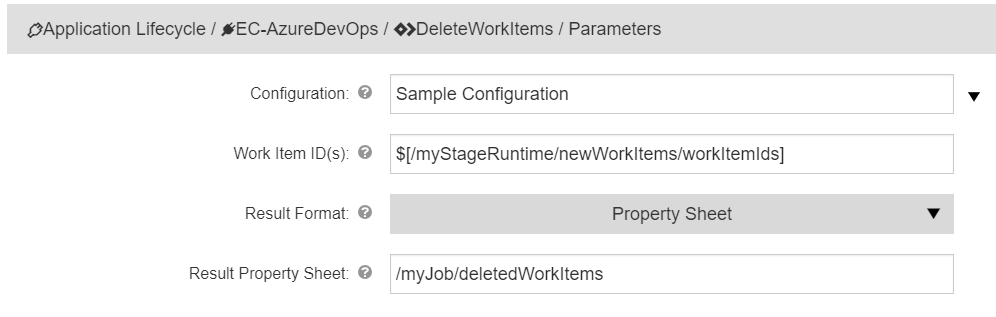
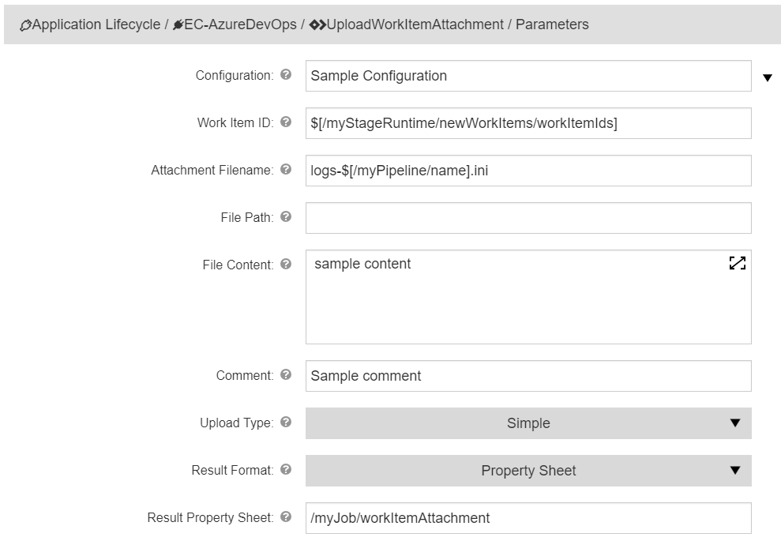
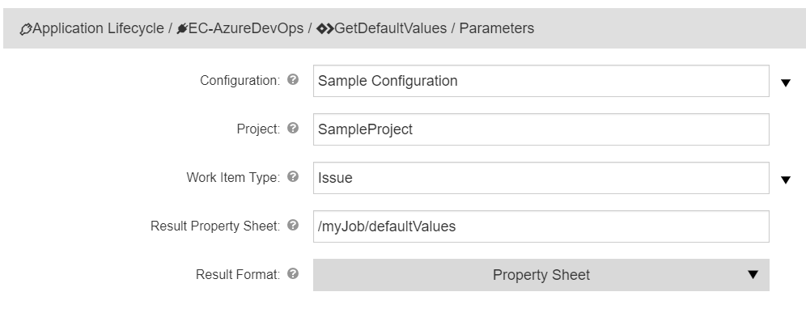
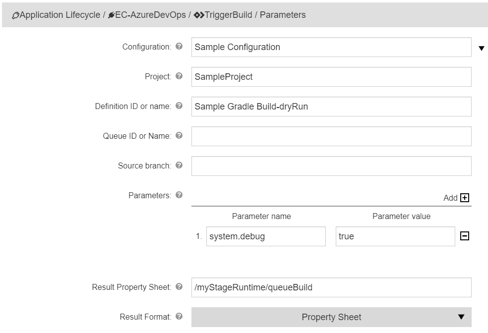
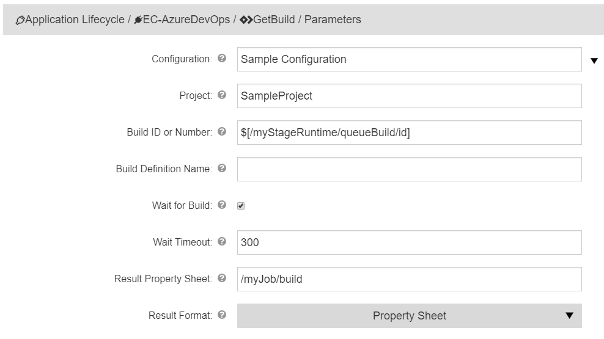

This plugin integrates CloudBees CD/RO with both Azure DevOps Services (previously known as VSTS) and Azure DevOps Server (previously known as TFS).

https://azure.microsoft.com/en-us/services/devops/ provides development collaboration tools including high-performance pipelines, free private Git repositories, configurable Kanban boards, and extensive automated and continuous testing capabilities.

https://azure.microsoft.com/en-us/services/devops/server/ is the on-premises version of Azure DevOps Services.


> **_IMPORTANT_**
> 
> In effort to streamline workflows and improve user experience, CloudBees
will be phasing out EC-AzureDevops in favor of a new Azure DevOps CLI
plugin. The phase-out will start with the CloudBees CD/RO 10.11 release,
where we will stop providing new feature support and patches for
EC-AzureDevops. The Azure DevOps CLI plugin will be released shortly
after.
>
>CloudBees suggests you transition from using EC-AzureDevops to
the [Azure DevOps plugin](https://docs.cloudbees.com/docs/cloudbees-cd-plugin-docs/latest/azuredevops/).


# Building the plugin
1. Download or clone the EC-AzureDevOps repository.

    ```
    git clone https://github.com/electric-cloud/EC-AzureDevOps.git
    ```

5. Use the [ecpluginbuilder](https://github.com/electric-cloud/ecpluginbuilder) to format and build the plugin.

    ```
     cd EC-AzureDevOps
     ecpluginbuilder --plugin-version 1.0.0 --plugin-name EC-AzureDevOps --folder dsl,htdocs,pages,META-INF
    ```

6. Import the plugin zip file into your CloudBees Flow server and promote it.


# Supported versions

The following table provides the Microsoft AzureDevOps Services and TFS
versions tested with this plugin and also the corresponding API version
that should be used when performing the plugin configuration (refer to
separate section which describes plugin configuration below).

<table>
<colgroup>
<col style="width: 33%" />
<col style="width: 33%" />
<col style="width: 33%" />
</colgroup>
<thead>
<tr class="header">
<th style="text-align: left;">Product Name</th>
<th style="text-align: left;">Product Version</th>
<th style="text-align: left;">API Version</th>
</tr>
</thead>
<tbody>
<tr class="odd">
<td style="text-align: left;"><p>AzureDevOps</p></td>
<td style="text-align: left;"><p>-</p></td>
<td style="text-align: left;"><p>5.0</p></td>
</tr>
<tr class="even">
<td style="text-align: left;"><p>TFS 2018 Update 2/3</p></td>
<td style="text-align: left;"><p>16.131</p></td>
<td style="text-align: left;"><p>4.1</p></td>
</tr>
<tr class="odd">
<td style="text-align: left;"><p>TFS 2018 Update RTW/1</p></td>
<td style="text-align: left;"><p>16.122</p></td>
<td style="text-align: left;"><p>4.0</p></td>
</tr>
<tr class="even">
<td style="text-align: left;"><p>TFS 2017 Update 2</p></td>
<td style="text-align: left;"><p>15.117</p></td>
<td style="text-align: left;"><p>3.2</p></td>
</tr>
<tr class="odd">
<td style="text-align: left;"><p>TFS 2017 Update 1</p></td>
<td style="text-align: left;"><p>15.112</p></td>
<td style="text-align: left;"><p>3.1</p></td>
</tr>
<tr class="even">
<td style="text-align: left;"><p>TFS 2017 RTW</p></td>
<td style="text-align: left;"><p>15.105</p></td>
<td style="text-align: left;"><p>3.0</p></td>
</tr>
<tr class="odd">
<td style="text-align: left;"><p>TFS 2015 Update 4</p></td>
<td style="text-align: left;"><p>14.114</p></td>
<td style="text-align: left;"><p>2.3</p></td>
</tr>
<tr class="even">
<td style="text-align: left;"><p>TFS 2015 Update 3</p></td>
<td style="text-align: left;"><p>14.102</p></td>
<td style="text-align: left;"><p>2.3</p></td>
</tr>
<tr class="odd">
<td style="text-align: left;"><p>TFS 2015 Update 2</p></td>
<td style="text-align: left;"><p>14.95</p></td>
<td style="text-align: left;"><p>2.2</p></td>
</tr>
<tr class="even">
<td style="text-align: left;"><p>TFS 2015 Update 1</p></td>
<td style="text-align: left;"><p>14.0</p></td>
<td style="text-align: left;"><p>2.1</p></td>
</tr>
<tr class="odd">
<td style="text-align: left;"><p>TFS 2015 RTW</p></td>
<td style="text-align: left;"><p>14.0</p></td>
<td style="text-align: left;"><p>2.0</p></td>
</tr>
</tbody>
</table>

# Plugin configurations

Plugin configurations are sets of parameters that apply across some or
all of the plugin procedures. They reduce repetition of common values,
create predefined parameter sets for end users, and securely store
credentials where needed. Each configuration is given a unique name that
is entered in designated parameters on procedures that use them.

**Note:** As mentioned in the Known Issues section Basic authentication
method does not work in certain cases. In such cases it is recommended
you [create a Personal Access Token
(PAT)](https://docs.microsoft.com/en-us/azure/devops/integrate/get-started/authentication/pats?view=azdevops)
and use the PAT authorization method.

# Configuration procedure parameters

<table>
<colgroup>
<col style="width: 50%" />
<col style="width: 50%" />
</colgroup>
<thead>
<tr class="header">
<th style="text-align: left;">Parameter</th>
<th style="text-align: left;">Description</th>
</tr>
</thead>
<tbody>
<tr class="odd">
<td style="text-align: left;"><p>Configuration</p></td>
<td style="text-align: left;"><p>Unique name for the plugin
configuration.</p></td>
</tr>
<tr class="even">
<td style="text-align: left;"><p>Description</p></td>
<td style="text-align: left;"><p>Description for the plugin
configuration.</p></td>
</tr>
<tr class="odd">
<td style="text-align: left;"><p>AzureDevOps Server/Services
Endpoint</p></td>
<td style="text-align: left;"><p>AzureDevOps endpoint (<a href="https://dev.azure.com">https://dev.azure.com</a>) or TFS server
(scheme://server:port/tfs) URL.</p></td>
</tr>
<tr class="even">
<td style="text-align: left;"><p>Collection/Organization Name</p></td>
<td style="text-align: left;"><p>If using TFS specify Collection else
<em><em>DefaultCollection</em></em> will be used. If using AzureDevOps
specify Organization name.</p></td>
</tr>
<tr class="odd">
<td style="text-align: left;"><p>Auth Type</p></td>
<td style="text-align: left;"><p>Select the type of authentication to
use. Note: Some endpoints accept only PAT for authentication.</p></td>
</tr>
<tr class="even">
<td style="text-align: left;"><p>Credentials</p></td>
<td style="text-align: left;"><p>Username and password to connect to
AzureDevOps Services.</p></td>
</tr>
<tr class="odd">
<td style="text-align: left;"><p>Access Token</p></td>
<td style="text-align: left;"><p><a href="https://docs.microsoft.com/en-us/azure/devops/integrate/get-started/authentication/pats?view=azure-devops">You can generate one on the TFS/AzureDevOps side</a></p></td>
</tr>
<tr class="even">
<td style="text-align: left;"><p>Check Connection?</p></td>
<td style="text-align: left;"><p>If checked, the credentials will be
checked before the configuration is saved.</p></td>
</tr>
<tr class="odd">
<td style="text-align: left;"><p>TFS API Version</p></td>
<td style="text-align: left;"><p>Specify the TFS API version. For
AzureDevOps, use the latest one. For TFS Server, refer to the version
table in Supported Version section.</p></td>
</tr>
<tr class="even">
<td style="text-align: left;"><p>Log Level</p></td>
<td style="text-align: left;"><p>This option sets debug level for logs.
If info is selected, only summary information will be show, for debug,
there will be some debug information and for trace the whole requests
and responses will be shown.</p></td>
</tr>
<tr class="odd">
<td style="text-align: left;"><p>HTTP Proxy</p></td>
<td style="text-align: left;"><p>A proxy that should be used for
connections.</p></td>
</tr>
<tr class="even">
<td style="text-align: left;"><p>Proxy Authorization</p></td>
<td style="text-align: left;"><p>Username and password for
proxy.</p></td>
</tr>
</tbody>
</table>



# Plugin procedures

**IMPORTANT** Note that the names of Required parameters are marked in
<span class=".required">bold italics</span> in the parameter description
table for each procedure.

## CreateWorkItems

This procedure creates one or multiple new work items. In order to
facilitate creation of multiple Work Items the parameters Work Items
JSON is provided to specify Multiple Work items.

In order to facilitate creation of multiple Work Items the parameters
Work Items JSON is provided to specify Multiple Work items.

### CreateWorkItems parameters

<table>
<colgroup>
<col style="width: 50%" />
<col style="width: 50%" />
</colgroup>
<thead>
<tr class="header">
<th style="text-align: left;">Parameter</th>
<th style="text-align: left;">Description</th>
</tr>
</thead>
<tbody>
<tr class="odd">
<td style="text-align: left;"><p>Configuration</p></td>
<td style="text-align: left;"><p>Previously defined plugin
configuration.</p></td>
</tr>
<tr class="even">
<td style="text-align: left;"><p>Title</p></td>
<td style="text-align: left;"><p>Short description of the work
item.</p></td>
</tr>
<tr class="odd">
<td style="text-align: left;"><p>Project name</p></td>
<td style="text-align: left;"><p>Name or ID of a <a href="https://docs.microsoft.com/uk-ua/rest/api/azure/devops/wit/?view=azure-devops-rest-4.1">team project</a> where the work item should be created.</p></td>
</tr>
<tr class="even">
<td style="text-align: left;"><p>Type</p></td>
<td style="text-align: left;"><p>Name of the <a href="https://docs.microsoft.com/uk-ua/rest/api/azure/devops/wit/?view=azure-devops-rest-4.1">work
item type</a>.</p></td>
</tr>
<tr class="odd">
<td style="text-align: left;"><p>Priority</p></td>
<td style="text-align: left;"><p>Priority for completing the work item,
based on business goals. Parameter should contain a number</p></td>
</tr>
<tr class="even">
<td style="text-align: left;"><p>Assign To</p></td>
<td style="text-align: left;"><p>The person currently assigned to the
work item. The value can contain an email or a fully specified name of
an assignee</p></td>
</tr>
<tr class="odd">
<td style="text-align: left;"><p>Description</p></td>
<td style="text-align: left;"><p>Description for the work item. Will be
rendered as HTML in the AzureDevOps/TFS UI. This field will not be shown
in the TFS UI if the work item type is <em>Bug</em>.</p></td>
</tr>
<tr class="even">
<td style="text-align: left;"><p>Repro Steps</p></td>
<td style="text-align: left;"><p>Steps to reproduce the bug. Will be
rendered as HTML in the AzureDevOps/TFS UI. This field will not be shown
in the TFS UI unless the work item type is <em>Bug</em>.</p></td>
</tr>
<tr class="odd">
<td style="text-align: left;"><p>System Info</p></td>
<td style="text-align: left;"><p>Environment information for the created
bug. Will be rendered as HTML in the AzureDevOps/TFS UI. This field will
not be shown in the TFS UI unless the work item type is
<em>Bug</em>.</p></td>
</tr>
<tr class="even">
<td style="text-align: left;"><p>Work Items JSON</p></td>
<td style="text-align: left;"><p>Use this parameter if you need to
create multiple work items and use the JSON convention to enter their
information, like in this example.</p>
<p><strong>[{"Title": "Title for the first work item", "Type": "Task",
"Priority": 2}, {"Title": "Title for the second work item", "Priority":
2}]</strong></p></td>
</tr>
<tr class="odd">
<td style="text-align: left;"><p>Additional Fields</p></td>
<td style="text-align: left;"><p>Use this parameter to specify values
beyond the named parameters. This an advanced usage field, please refer
to the "Usage Example" below or the <a href="https://docs.microsoft.com/uk-ua/rest/api/azure/devops/wit/work%20items/update?view=azure-devops-rest-4.1#examples">Azure
DevOps documentation.</a></p></td>
</tr>
<tr class="even">
<td style="text-align: left;"><p>Result Format</p></td>
<td style="text-align: left;"><p>Format to save the request
results.</p></td>
</tr>
<tr class="odd">
<td style="text-align: left;"><p>Result Property Sheet</p></td>
<td style="text-align: left;"><p>Results will be saved into this
property/property sheet. Property <em>workItemIds</em> under the result
property sheet will contain IDs for the created work items.</p></td>
</tr>
</tbody>
</table>

### Usage example:



## QueryWorkItems

Queries work items and saves them under the specified property.

The fields retrieved for each Work Item is based either on the fields
contained in the definition of either the Query ID or the WIQL as the
case may be.

### QueryWorkItems parameters

<table>
<colgroup>
<col style="width: 50%" />
<col style="width: 50%" />
</colgroup>
<thead>
<tr class="header">
<th style="text-align: left;">Parameter</th>
<th style="text-align: left;">Description</th>
</tr>
</thead>
<tbody>
<tr class="odd">
<td style="text-align: left;"><p>Configuration</p></td>
<td style="text-align: left;"><p>Previously defined plugin
configuration.</p></td>
</tr>
<tr class="even">
<td style="text-align: left;"><p>Project</p></td>
<td style="text-align: left;"><p>Filter the results to this team
project. If your query string uses the @project macro (e.g.
<em>[System.TeamProject] = @project</em>), you must specify the
project.</p></td>
</tr>
<tr class="odd">
<td style="text-align: left;"><p>Query ID</p></td>
<td style="text-align: left;"><p>Specify a Query ID.</p>
<p>Use this parameter only if not specifying Query Text.</p></td>
</tr>
<tr class="even">
<td style="text-align: left;"><p>Query Text</p></td>
<td style="text-align: left;"><p>Specify a WIQL or Query ID.</p>
<p>Use this parameter only if not specifying Query ID.</p></td>
</tr>
<tr class="odd">
<td style="text-align: left;"><p>Time precision</p></td>
<td style="text-align: left;"><p>If checked, time precision (HH:MM:SS)
is allowed in the date time comparisons.</p></td>
</tr>
<tr class="even">
<td style="text-align: left;"><p>Result Format</p></td>
<td style="text-align: left;"><p>Format to save the request
results.</p></td>
</tr>
<tr class="odd">
<td style="text-align: left;"><p>Result Property Sheet</p></td>
<td style="text-align: left;"><p>Results will be saved into this
property/property sheet.</p></td>
</tr>
</tbody>
</table>

### Usage Example:



## GetWorkItems

Retrieves work items based on specified IDs. The fields per work item
are returned based on a specified list. This procedure allows you to
retrieve the specified fields per work item (or list of basic fields if
no field is specified).

The fields per work item are returned based on a specified list. This
procedure allows you to retrieve the specified fields per work item (or
all if no field is specified). You can also specify **As of (date)**
parameter as a UTC date time string (*2019-01-15T13:45:30*) to get all
work items as they existed at that time.

### GetWorkItems parameters

<table>
<colgroup>
<col style="width: 50%" />
<col style="width: 50%" />
</colgroup>
<thead>
<tr class="header">
<th style="text-align: left;">Parameter</th>
<th style="text-align: left;">Description</th>
</tr>
</thead>
<tbody>
<tr class="odd">
<td style="text-align: left;"><p>Configuration</p></td>
<td style="text-align: left;"><p>Previously defined plugin
configuration.</p></td>
</tr>
<tr class="even">
<td style="text-align: left;"><p>Work Item IDs</p></td>
<td style="text-align: left;"><p>A comma-separated list of up to 200
Work Item IDs.</p></td>
</tr>
<tr class="odd">
<td style="text-align: left;"><p>Only Fields</p></td>
<td style="text-align: left;"><p>Specify comma-separated list of fields
(as per example below) that need to be retrieved per work item.</p>
<p>If this parameter is left empty all fields will be returned.</p>
<p>Example: <strong><em>System.State, System.IterationPath,
Microsoft.VSTS.Common.StateChangeDate,
Microsoft.VSTS.Common.Priority</em></strong>. Refer to <a href="#">https://dev.azure.com/{yourOrganizationName}/_apis/wit/fields</a>
to see all the available fields.</p>
<p>This parameter cannot be specified with the "Expand Relationships"
parameter.</p></td>
</tr>
<tr class="even">
<td style="text-align: left;"><p>As of (date)</p></td>
<td style="text-align: left;"><p>UTC date time string
(<em>2019-01-15T13:45:30</em>). Gets the work items as they existed at
this time.</p></td>
</tr>
<tr class="odd">
<td style="text-align: left;"><p>Expand Relationships</p></td>
<td style="text-align: left;"><p>Gets work item relationships (work item
links, hyperlinks, file attachements, etc.). This parameter cannot be
specified with the <strong>"Only Fields"</strong>.</p>
<p><strong>Some of the types were introduced in newer TFS
APIs.</strong></p></td>
</tr>
<tr class="even">
<td style="text-align: left;"><p>Result Property Sheet</p></td>
<td style="text-align: left;"><p>Results will be saved into this
property/property sheet.</p></td>
</tr>
<tr class="odd">
<td style="text-align: left;"><p>Result Format</p></td>
<td style="text-align: left;"><p>Format to save the request
results.</p></td>
</tr>
</tbody>
</table>

### Usage example:

**Work Item ID(s)** field here refers the result of the CreateWorkItems
procedure, you can use the comma-separated numeric values instead.



## UpdateWorkItems

Updates field values for one or more Work Items based on specified ids.

### UpdateWorkItems parameters

<table>
<colgroup>
<col style="width: 50%" />
<col style="width: 50%" />
</colgroup>
<thead>
<tr class="header">
<th style="text-align: left;">Parameter</th>
<th style="text-align: left;">Description</th>
</tr>
</thead>
<tbody>
<tr class="odd">
<td style="text-align: left;"><p>Configuration</p></td>
<td style="text-align: left;"><p>Previously defined plugin
configuration.</p></td>
</tr>
<tr class="even">
<td style="text-align: left;"><p>Work Item ID(s)</p></td>
<td style="text-align: left;"><p>ID(s) of the work items to be
updated.</p></td>
</tr>
<tr class="odd">
<td style="text-align: left;"><p>Title</p></td>
<td style="text-align: left;"><p>New title for the work item(s) to be
updated.</p></td>
</tr>
<tr class="even">
<td style="text-align: left;"><p>Priority</p></td>
<td style="text-align: left;"><p>New priority for the work item(s) to be
updated.</p>
<p>Priority refers to completing the work item, based on business goals.
This field should contain a number.</p></td>
</tr>
<tr class="odd">
<td style="text-align: left;"><p>Assign to</p></td>
<td style="text-align: left;"><p>The new person to be assigned for the
work item(s) to be updated.</p>
<p>The value can contain an email or a fully specified name of an
assignee.</p></td>
</tr>
<tr class="even">
<td style="text-align: left;"><p>Description</p></td>
<td style="text-align: left;"><p>New description for the work item. Will
be rendered as HTML in the AzureDevOps/TFS UI.</p></td>
</tr>
<tr class="odd">
<td style="text-align: left;"><p>Comment Body</p></td>
<td style="text-align: left;"><p>Comment with given text will be added
to the work item(s).</p></td>
</tr>
<tr class="even">
<td style="text-align: left;"><p>Additional Fields</p></td>
<td style="text-align: left;"><p>Additional fields to be added as a JSON
array. This an advanced usage field, please refer to the "Usage Example"
at the procedure’s help or the <a href="https://docs.microsoft.com/uk-ua/rest/api/azure/devops/wit/work%20items/update?view=azure-devops-rest-4.1#examples">Azure
DevOps documentation</a> for the examples.</p></td>
</tr>
<tr class="odd">
<td style="text-align: left;"><p>Result Format</p></td>
<td style="text-align: left;"><p>Format to save the request
results.</p></td>
</tr>
<tr class="even">
<td style="text-align: left;"><p>Result Property Sheet</p></td>
<td style="text-align: left;"><p>Updated items will be saved into this
property/property sheet.</p></td>
</tr>
</tbody>
</table>

### Usage Example:

**Work Item ID(s)** field here refers the result of the CreateWorkItems
procedure, you can use the comma-separated numeric values instead.



## DeleteWorkItems

Deletes the specified work items.

### DeleteWorkItems parameters

<table>
<colgroup>
<col style="width: 50%" />
<col style="width: 50%" />
</colgroup>
<thead>
<tr class="header">
<th style="text-align: left;">Parameter</th>
<th style="text-align: left;">Description</th>
</tr>
</thead>
<tbody>
<tr class="odd">
<td style="text-align: left;"><p>Configuration</p></td>
<td style="text-align: left;"><p>Previously defined plugin
configuration.</p></td>
</tr>
<tr class="even">
<td style="text-align: left;"><p>Work Item ID(s)</p></td>
<td style="text-align: left;"><p>ID(s) of the work item to
delete.</p></td>
</tr>
<tr class="odd">
<td style="text-align: left;"><p>Result Format</p></td>
<td style="text-align: left;"><p>Format to save the request
results.</p></td>
</tr>
<tr class="even">
<td style="text-align: left;"><p>Result Property Sheet</p></td>
<td style="text-align: left;"><p>Deleted items will be saved into this
property/property sheet.</p></td>
</tr>
</tbody>
</table>

### Usage Example:

**Work Item ID(s)** field here refers the result of the CreateWorkItems
procedure, you can use the comma-separated numeric values instead.



## UploadWorkItemAttachment

Use this procedure to upload an attachment to a Work item.

### UploadWorkItemAttachment parameters

<table>
<colgroup>
<col style="width: 50%" />
<col style="width: 50%" />
</colgroup>
<thead>
<tr class="header">
<th style="text-align: left;">Parameter</th>
<th style="text-align: left;">Description</th>
</tr>
</thead>
<tbody>
<tr class="odd">
<td style="text-align: left;"><p>Configuration</p></td>
<td style="text-align: left;"><p>Previously defined plugin
configuration.</p></td>
</tr>
<tr class="even">
<td style="text-align: left;"><p>Work Item ID</p></td>
<td style="text-align: left;"><p>ID of the work item.</p></td>
</tr>
<tr class="odd">
<td style="text-align: left;"><p>Attachment Filename</p></td>
<td style="text-align: left;"><p>The name of the file in the Attachment
store.</p>
<p>For example the uploaded file /var/tmp/foobar.txt as in File Path
could be called as Information.txt in the Attachment store.</p></td>
</tr>
<tr class="even">
<td style="text-align: left;"><p>File Path</p></td>
<td style="text-align: left;"><p>Absolute Path to the file to be
uploaded. For example /var/tmp/info.txt</p>
<p>Either this parameter or the "File Content" parameter is
Required.</p></td>
</tr>
<tr class="odd">
<td style="text-align: left;"><p>File Content</p></td>
<td style="text-align: left;"><p>Enter the File content to be uploaded
in this text area up to a limit of 64KB.</p>
<p>Either this parameter or the "File Path" parameter is
Required.</p></td>
</tr>
<tr class="even">
<td style="text-align: left;"><p>Comment</p></td>
<td style="text-align: left;"><p>Comment for the attachment.</p></td>
</tr>
<tr class="odd">
<td style="text-align: left;"><p>Upload Type</p></td>
<td style="text-align: left;"><p>Use chunked upload type for uploading
large files (&gt;130 MB).</p></td>
</tr>
<tr class="even">
<td style="text-align: left;"><p>Result Format</p></td>
<td style="text-align: left;"><p>Format to save the request
results.</p></td>
</tr>
<tr class="odd">
<td style="text-align: left;"><p>Result Property Sheet</p></td>
<td style="text-align: left;"><p>Result will be saved into this
property/property sheet.</p></td>
</tr>
</tbody>
</table>

### Usage Example:



## GetDefaultValues

Use this procedure to retrieve default values of a specified work item
type from a Project .

### GetDefaultValues parameters

<table>
<colgroup>
<col style="width: 50%" />
<col style="width: 50%" />
</colgroup>
<thead>
<tr class="header">
<th style="text-align: left;">Parameter</th>
<th style="text-align: left;">Description</th>
</tr>
</thead>
<tbody>
<tr class="odd">
<td style="text-align: left;"><p>Configuration</p></td>
<td style="text-align: left;"><p>Previously defined plugin
configuration.</p></td>
</tr>
<tr class="even">
<td style="text-align: left;"><p>Project</p></td>
<td style="text-align: left;"><p>Name or ID of a team project where the
work item type is defined.</p></td>
</tr>
<tr class="odd">
<td style="text-align: left;"><p>Work Item Type</p></td>
<td style="text-align: left;"><p>Name of the work item type.</p>
<p>Example: <strong>Feature</strong>, <strong>Bug</strong></p></td>
</tr>
<tr class="even">
<td style="text-align: left;"><p>Result Property Sheet</p></td>
<td style="text-align: left;"><p>Results will be saved into this
property/property sheet.</p></td>
</tr>
<tr class="odd">
<td style="text-align: left;"><p>Result Format</p></td>
<td style="text-align: left;"><p>Format to save the request
results.</p></td>
</tr>
</tbody>
</table>

### Usage Example:



## TriggerBuild

This procedure triggers and queues a build based on the build definition
and Queue name respectively.

### TriggerBuild parameters

<table>
<colgroup>
<col style="width: 50%" />
<col style="width: 50%" />
</colgroup>
<thead>
<tr class="header">
<th style="text-align: left;">Parameter</th>
<th style="text-align: left;">Description</th>
</tr>
</thead>
<tbody>
<tr class="odd">
<td style="text-align: left;"><p>Configuration</p></td>
<td style="text-align: left;"><p>Previously defined plugin
configuration.</p></td>
</tr>
<tr class="even">
<td style="text-align: left;"><p>Project</p></td>
<td style="text-align: left;"><p>Team project ID or name.</p></td>
</tr>
<tr class="odd">
<td style="text-align: left;"><p>Definition ID or name</p></td>
<td style="text-align: left;"><p>The ID or the name of the Build
Definition.</p></td>
</tr>
<tr class="even">
<td style="text-align: left;"><p>Queue ID or Name</p></td>
<td style="text-align: left;"><p>The ID or the name of the queue. If not
specified, the default queue for the definition will be used.</p></td>
</tr>
<tr class="odd">
<td style="text-align: left;"><p>Source branch</p></td>
<td style="text-align: left;"><p>The name of the branch from which to
build.</p>
<p>If not specified, the default branch for the definition will be
used.</p></td>
</tr>
<tr class="even">
<td style="text-align: left;"><p>Parameters</p></td>
<td style="text-align: left;"><p>Parameters to pass to the build
specified as name-value pairs, with 1 pair per line.</p>
<p>If not specified, the default variables for the definition will be
used.</p>
<p>Example:</p>
<p><strong>system.debug=true</strong></p>
<p><strong>BuildConfiguration=debug</strong></p>
<p><strong>BuildPlatform=x64</strong></p></td>
</tr>
<tr class="odd">
<td style="text-align: left;"><p>Result Property Sheet</p></td>
<td style="text-align: left;"><p>Results will be saved into this
property/property sheet.</p></td>
</tr>
<tr class="even">
<td style="text-align: left;"><p>Result Format</p></td>
<td style="text-align: left;"><p>Format to save the request
results.</p></td>
</tr>
</tbody>
</table>

### Usage Example:



## GetBuild

Retrieves the build info of a specific build.

### GetBuild parameters

<table>
<colgroup>
<col style="width: 50%" />
<col style="width: 50%" />
</colgroup>
<thead>
<tr class="header">
<th style="text-align: left;">Parameter</th>
<th style="text-align: left;">Description</th>
</tr>
</thead>
<tbody>
<tr class="odd">
<td style="text-align: left;"><p>Configuration</p></td>
<td style="text-align: left;"><p>Previously defined plugin
configuration.</p></td>
</tr>
<tr class="even">
<td style="text-align: left;"><p>Project</p></td>
<td style="text-align: left;"><p>ID or name of the team
project.</p></td>
</tr>
<tr class="odd">
<td style="text-align: left;"><p>Build ID or Number</p></td>
<td style="text-align: left;"><p>ID or number of the build. For example
<em>20190110.1</em> or <em>26</em></p>
<p>You could specify the wild-card pattern 2019* to get the latest build
that starts with 2019.</p></td>
</tr>
<tr class="even">
<td style="text-align: left;"><p>Build Definition Name</p></td>
<td style="text-align: left;"><p>Name for the Build Definition. This
parameter is required if you’ve specified Build number in a "Build Id or
Number" parameter as it is used for the Build search.</p></td>
</tr>
<tr class="odd">
<td style="text-align: left;"><p>Wait for Build</p></td>
<td style="text-align: left;"><p>If checked, the procedure will wait
until the build is finished or until the wait time exceeds the value
specified in the Wait Timeout, whichever is earlier.</p></td>
</tr>
<tr class="even">
<td style="text-align: left;"><p>Wait Timeout</p></td>
<td style="text-align: left;"><p>Timeout in seconds to wait for build to
finish. Will be used if "Wait for build" is checked. Default waiting
time is 300 secs.</p></td>
</tr>
<tr class="odd">
<td style="text-align: left;"><p>Result Format</p></td>
<td style="text-align: left;"><p>Format to save the request
results.</p></td>
</tr>
<tr class="even">
<td style="text-align: left;"><p>Result Property Sheet</p></td>
<td style="text-align: left;"><p>Results will be saved into this
property/property sheet.</p></td>
</tr>
</tbody>
</table>

### Usage Example:



# Known issues

AzureDevOps Services and some TFS Servers (default depends on the
version), does not accept clear password for the **Basic**
authentication method. You should [create a Personal Access Token
(PAT)](https://docs.microsoft.com/en-us/azure/devops/integrate/get-started/authentication/pats?view=azdevops)
and use it instead of a password.

Uploading Attachments in the "Chunked" mode when using NTLM
authentication via proxied connection may fail if proxy server closes
connection after a POST request without a response content.

# AzureDevOps native extension plugin

CloudBees CD/RO has a Native Extension plugin available in the
AzureDevOps Marketplace which can perform build tasks (such as Publish
Artifact, Run Pipeline etc.,) in CloudBees CD/RO as post build actions
to TFS builds. Refer to [this
link](https://marketplace.visualstudio.com/items?itemName=ElectricCloud.electric-flow)
for more details.

# Release notes

## EC-AzureDevOps 1.0.6

-   The documentation has been migrated to the main documentation site.

## EC-AzureDevOps 1.0.4

-   Renaming to "CloudBees CD/RO".

## EC-AzureDevOps 1.0.3

-   Incorrect error message that sometimes appeared during configuration
    creation was removed.

## EC-AzureDevOps 1.0.2

-   Renaming to "CloudBees".

## EC-AzureDevOps 1.0.1

-   The plugin documentation has been updated.

## EC-AzureDevOps 1.0.0

-   Initial release.
